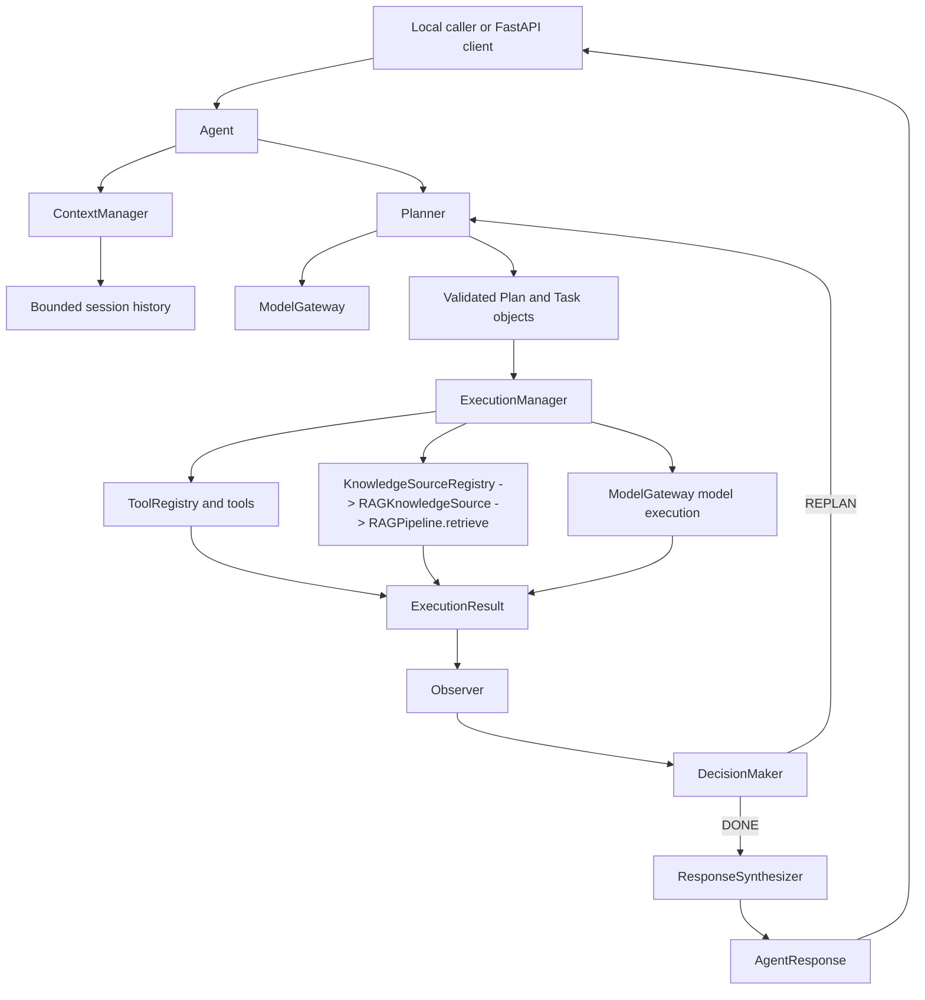

# Vexux-AI

Vexux-AI is a modular agent platform built around a small language model, structured planning, tools, retrieval-augmented generation, session context, and a bounded execution loop.

The architecture separates model reasoning from capability execution, retrieval, tools, request state, failure handling, and response synthesis.

The generic execution path is:

```text
Agent -> Planner -> ResourceRouter -> Authorization -> ExecutionManager
      -> registered adapter -> Evidence/Audit/Observability
```

The fraud application adds its domain entities, deterministic investigation
service, bounded workflow, fraud policy, Neo4j graph resources, and MySQL
business-data resource without moving factual signals into the model.

## Architecture

```text
API or local caller
    -> Agent
    -> ContextManager
    -> Planner
    -> validated Plan / Task objects
    -> ExecutionManager
        -> ToolRegistry / tools
        -> KnowledgeSourceRegistry -> RAGKnowledgeSource -> RAGPipeline.retrieve()
        -> ModelGateway
            -> MistralProvider (default)
            -> QwenProvider (local fallback)
    -> Observer
    -> DecisionMaker
    -> Replanner when necessary
    -> ResponseSynthesizer
    -> AgentResponse
```

The Agent owns orchestration only. The Planner creates structured plans, ExecutionManager dispatches tasks, Observer normalizes outcomes, DecisionMaker chooses `DONE` or `REPLAN`, and ResponseSynthesizer produces the final answer. ContextManager owns request state and bounded in-memory session history isolated by `session_id`.



## Capabilities

- Agent orchestration with bounded retries and scoped failure/replanning.
- Structured multi-task plans validated before execution.
- Sequential task execution.
- Generic `ToolRegistry` with dynamic tool discovery.
- Calculator, string formatter, and text analyzer tools.
- RAG retrieval with configurable top-k and similarity-threshold handling.
- Domain-agnostic `KnowledgeSourceRegistry` with the existing RAG implementation registered through an adapter.
- Retrieval tasks may explicitly select a registered knowledge source; grounded retrieval answers include deterministic source attribution.
- Controlled no-result and capability failure behavior.
- Grounded response synthesis for retrieval and multi-task results.
- Bounded in-memory conversation state by `session_id`.
- FastAPI API and structured task observability.
- Deterministic pytest coverage and a 44-case evaluation suite.

## Repository Structure

```text
agent/                    Agent orchestration, planning, dispatch, observation, decisions
api/                      FastAPI application (`api/main.py`)
apps/                     Domain-specific application boundaries (for example `apps/fraud/`)
core/                     Composition root, contracts, gateway, context, tools
rag/                      Loading, chunking, embeddings, FAISS retrieval, prompting, RAG knowledge adapter
models/                   Mistral/Qwen providers and local Qwen adapter checkpoints
training/                 Training and inference utilities
lora/                     LoRA adapter management
data/                     Training datasets and RAG documents
configs/                  Model and training configuration
evaluation/               Standalone deterministic system evaluation suite
docs/                     Architecture, contracts, and roadmap documentation
test_*.py                 Pytest unit and integration tests
```

RAG documents are read from `data/documents/`. The Qwen fallback uses the local adapter at `models/checkpoints`.

## Local setup

The project is developed with Python 3.11. From the repository root:

Follow [the authoritative local setup guide](docs/SETUP.md). In brief:

```powershell
python -m venv .venv
.\.venv\Scripts\Activate.ps1
python -m pip install -r requirements.txt -r requirements-dev.txt
Copy-Item .env.example .env
```

The centralized loader reads the repository `.env`; explicit process
environment variables take precedence. Use `MODEL_PROVIDER=fake` for
credential-free deterministic tests. Ollama, Mistral, and Qwen are optional
provider paths; no provider service or model download is required for tests.

## Knowledge graph backends

Vexux supports pluggable graph backends through the common
`KnowledgeGraphContract` and `KnowledgeGraphRegistry`. The default in-memory
backend needs no external service. Neo4j is an optional adapter; configure it
without putting credentials in source:

```powershell
$env:ENABLE_KNOWLEDGE_GRAPH = "1"
$env:NEO4J_URI = "bolt://localhost:7687"
$env:NEO4J_USERNAME = "neo4j"
$env:NEO4J_PASSWORD = "your-password"
$env:NEO4J_GRAPH_NAME = "customer_graph"
```

Each graph database backend requires its own adapter implementing the contract;
the core does not expose arbitrary Cypher execution. The real fraud
composition registers both `customer_graph` and `fraud_graph` against local
Neo4j. Its reproducible schema and seed are in `apps/fraud/data/neo4j/`.
The repeatable schema and seed commands are documented in [docs/SETUP.md](docs/SETUP.md).

The heterogeneous investigation proof uses the same registry and execution
path for both backends:

```text
KnowledgeGraphRegistry
├── customer_graph -> Neo4jKnowledgeGraph
└── fraud_graph    -> InMemoryKnowledgeGraph
```

Run it with `python -m scripts.manual.heterogeneous_multigraph_demo`. It
requires an explicitly configured Neo4j connection; otherwise it reports that
the real-backend portion is unavailable rather than claiming a successful run.

## SQL knowledge source

`SQLKnowledgeSource` provides a contract-level adapter to relational data.
`SQLiteBackend` remains the lightweight test backend, while `MySQLBackend`
uses `mysql-connector-python` for the real fraud application. Only a single
`SELECT` statement is accepted and values are passed as DB-API parameters.
The fraud schema and deterministic seed are in `apps/fraud/data/mysql/`.
Authorization, audit events, and `structured_data` evidence use the existing
knowledge-source flow.

The repeatable real-resource bootstrap and verification commands are in
[docs/SETUP.md](docs/SETUP.md). Historical demonstrations are retained under
`scripts/history/` and are not authoritative entry points.

## Real local fraud platform

The real application requires local Neo4j and MySQL; it never falls back to
the synthetic demo. Set these variables without committing credentials:

```powershell
$env:MODEL_PROVIDER = "mistral"
$env:NEO4J_URI = "bolt://localhost:7687"
$env:NEO4J_USERNAME = "neo4j"
$env:NEO4J_PASSWORD = "<local Neo4j password>"
$env:NEO4J_DATABASE = "neo4j"
$env:MYSQL_HOST = "127.0.0.1"
$env:MYSQL_PORT = "3306"
$env:MYSQL_USER = "vexux_app"
$env:MYSQL_PASSWORD = "<local MySQL password>"
$env:MYSQL_DATABASE = "vexux_fraud"
```

Run the schema and seed files using the commands in [docs/SETUP.md](docs/SETUP.md).
Start the real interactive application with:

```powershell
python -m scripts.manual.run_agent
```

Live local integration tests are in `tests/live/test_fraud_databases.py` and
run only when the required local credentials are configured:

```powershell
python -m pytest tests/live/test_fraud_databases.py -q
```

## Model Provider Configuration

Mistral is the default provider:

```powershell
$env:MODEL_PROVIDER = "mistral"
$env:MISTRAL_MODEL = "mistral-small-latest"
$env:MISTRAL_API_KEY = "your-key-from-mistral"
```

The key is read only from `MISTRAL_API_KEY`. Never hardcode, log, or commit API keys. `.env` and `.env.*` files are ignored. The centralized configuration loader
reads `.env` automatically and never overrides explicit process environment
variables.

To use local Qwen instead:

```powershell
$env:MODEL_PROVIDER = "qwen"
$env:QWEN_MODEL = "Qwen/Qwen2.5-0.5B-Instruct"
```

Qwen remains available through its existing local adapter path. The Mistral provider never uses `adapter_path` or the Qwen checkpoint.

Provider roles are intentionally explicit: `fake` is for deterministic tests,
Ollama is the zero-budget local runtime option, Mistral is an optional external
provider, and Qwen is an optional existing local provider.

## Running the Agent

```powershell
python -m scripts.manual.run_agent
```

This starts the fraud application's real Neo4j/MySQL composition. It requires
the local database variables above and a configured Mistral key by default.

For the direct RAG demonstration:

```powershell
python test.py
```

## Running the API

```powershell
uvicorn api.main:app --reload
```

For a credential-free local smoke run:

```powershell
$env:MODEL_PROVIDER = "fake"
python -m uvicorn api.main:app --host 0.0.0.0 --port 8000
```

Endpoint:

```text
POST /api/v1/agent/run
```

The existing agent endpoint remains backward compatible. The thin orchestrator
boundary is also available at `POST /api/v1/orchestrator/run` with the same
`query`, optional `session_id`/`user_id`, and existing routing fields such as
`agent`, `workflow`, and `delegations`. Responses include redacted output/error,
request identity, optional orchestration identity, and safe metadata.

Operational endpoints:

```text
GET /health
GET /ready
GET /api/v1/orchestrator/{request_id}/trace
```

`/health` checks process liveness. `/ready` validates configuration without
calling external providers. The trace endpoint returns redacted audit events
only. The API accepts an already-authenticated `user_id` from callers but does
not implement authentication.

Example request:

```json
{
  "query": "What is EC2 and calculate 24 * 7",
  "session_id": "demo-session",
  "user_id": "demo-user"
}
```

Example response shape:

```json
{
  "request_id": "generated-request-id",
  "session_id": "demo-session",
  "user_id": "demo-user",
  "success": true,
  "output": "...",
  "error": null,
  "trace": [
    {
      "success": true,
      "output": "...",
      "error": null,
      "summary": "Task 'task-1' completed successfully.",
      "task_id": "task-1"
    }
  ]
}
```

The route delegates to `Agent.run()` and contains no orchestration logic.

## Validation

```powershell
python -m pytest
python -m evaluation
```

These are the canonical deterministic validation commands used by CI.

## Example Scenarios

### Retrieval

```text
What is EC2?
```

The Planner creates a retrieval task, the default registered RAG knowledge source returns scored context, and the response is synthesized from that context. SQL, graph, API-documentation, and external knowledge sources are not implemented yet.

### Tool

```text
Calculate 24 * 7
```

CalculatorTool returns `168` through ToolRegistry.

### Multi-task

```text
What is EC2 and calculate 24 * 7
```

The Planner creates sequential retrieval and calculator tasks. Their observations remain in the response trace.

### Failure and replanning

```text
Calculate abc
```

The calculator fails in a controlled way; Observer and DecisionMaker route the request through bounded replanning.

### Session follow-up

```text
Request 1, session_id = demo-session:
What is EC2?

Request 2, session_id = demo-session:
What about its pricing?
```

The second request receives bounded prior context. A different session ID does not.

### API request

```powershell
Invoke-RestMethod `
  -Method Post `
  -Uri http://127.0.0.1:8000/api/v1/agent/run `
  -ContentType "application/json" `
  -Body '{"query":"Calculate 24 * 7","session_id":"demo-session"}'
```

## Observability

Task logs expose:

- `request_id`
- `session_id`
- `task_id`
- `capability`
- `execution_success`
- `execution_duration_ms`

`AgentResponse.trace` preserves structured observations for the request, and the API serializes that trace.

## Tests

Run the complete test suite:

```powershell
python -m pytest -q
```

The deterministic suite is the canonical offline validation path. Its current
verified result is reported by the command; live provider/database tests are
separate and opt-in or credential-gated.

Run the system evaluation suite:

```powershell
python -m evaluation
```

The evaluation suite uses deterministic doubles and does not make real model
API calls.

The evaluation suite reports total, passed, failed, pass rate, category-level results, and failure details. It uses deterministic doubles and does not make real model API calls.

## Production Limitations

- Session state is in-memory and lost on process restart.
- Execution and generation are synchronous.
- No authentication or authorization is implemented.
- The FAISS RAG index is built in memory and is not persistent.
- No distributed tracing backend is configured.
- Evaluation history is not persisted.
- Tool input schemas are intentionally lightweight and validate required arguments and declared string fields during planning.
- Evaluation uses deterministic doubles rather than live production models.
- Model and embedding initialization has significant startup cost.
- Mistral API availability, latency, quotas, and costs are external dependencies.
- Qwen remains a local fallback but requires its adapter/checkpoint assets.

## Design Principles

- **Separation of concerns:** orchestration, planning, execution, observation, decision, and synthesis have distinct owners.
- **Contract-first design:** components communicate through explicit dataclasses and protocols.
- **Dependency injection:** concrete providers and capabilities are wired in `core/composition.py`.
- **Domain-agnostic core:** domain knowledge belongs in documents, tools, or model/configuration layers rather than the Agent loop.
- **Vertical-slice development:** capabilities are implemented and tested across their full path.
- **Minimal abstractions:** introduce abstractions only for concrete needs.

## Future Roadmap

See [docs/ROADMAP.md](docs/ROADMAP.md) for planned work such as persistent storage, DAG planning, multi-agent orchestration, expanded tools, asynchronous execution, and additional model backends. Those are not current capabilities.
