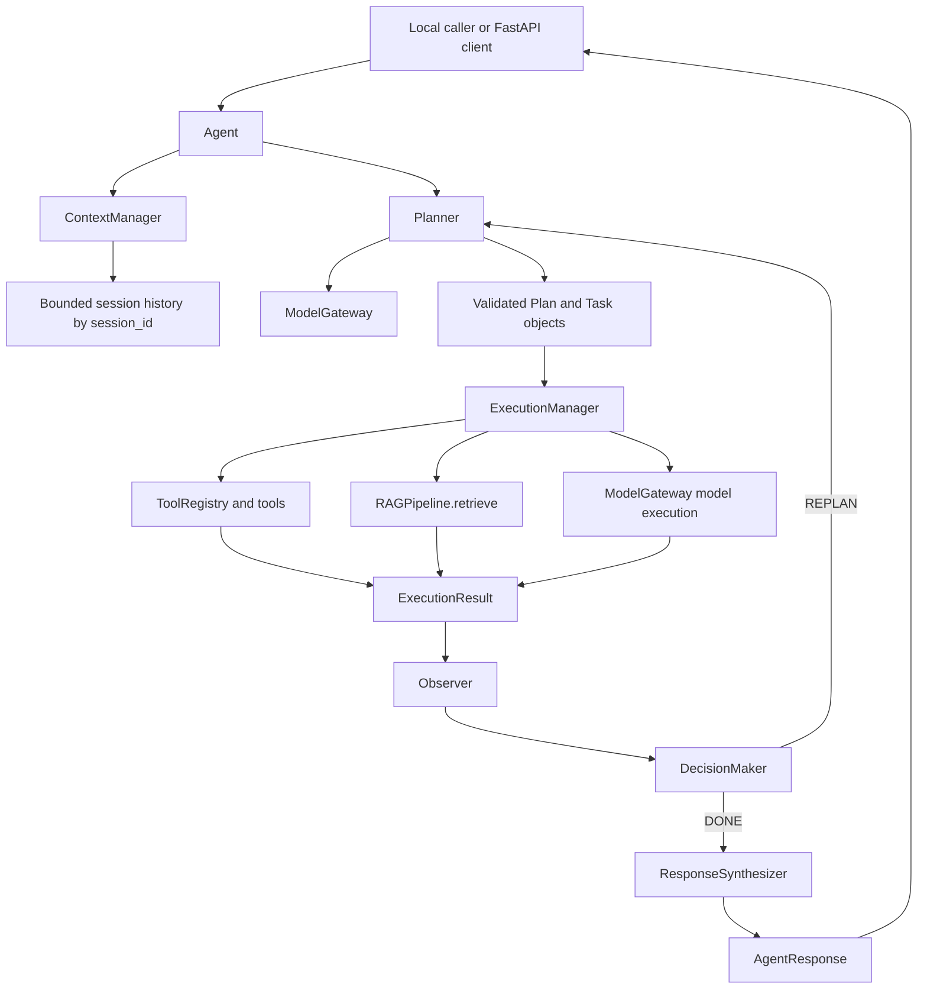

# Vexux-AI

## 1. Overview

Vexux-AI is a modular agent platform built around a small language model (SLM), structured planning, tools, retrieval-augmented generation (RAG), session context, and a bounded execution loop.

It addresses a practical engineering problem: how to connect model reasoning to reliable capabilities without placing tool logic, retrieval logic, model-provider details, and request state inside one monolithic agent. The project demonstrates explicit contracts, dependency injection, controlled failures, sequential multi-task execution, and observable execution traces.

## 2. Key Capabilities

The current milestone includes:

- Agent orchestration with bounded retries and replanning.
- Structured multi-task plans validated before execution.
- Sequential task execution.
- Generic `ToolRegistry` and dynamic tool discovery in Planner prompts.
- Calculator, string formatter, and text analyzer tools.
- RAG retrieval with configurable top-k and similarity-threshold handling.
- Controlled no-result and capability failure behavior.
- Response synthesis for multi-task and grounded retrieval results.
- Bounded in-memory session conversation state isolated by `session_id`.
- FastAPI endpoint for agent requests.
- Structured task observability.
- 54 automated unit/integration tests.
- A deterministic system evaluation suite with 44 scenarios.

## 3. Architecture

The runtime flow is:

```text
API or local caller
    -> Agent
    -> ContextManager creates request/session context
    -> Planner generates and validates Plan / Task objects
    -> Agent executes tasks sequentially
    -> ExecutionManager
        -> ToolRegistry / tools
        -> RAGPipeline.retrieve()
        -> ModelGateway
    -> Observer creates an Observation
    -> DecisionMaker returns DONE or REPLAN
    -> Planner creates a scoped recovery plan when needed
    -> ResponseSynthesizer
    -> AgentResponse
```

`Agent` owns orchestration only. `Planner` creates structured plans, `ExecutionManager` dispatches tasks, `Observer` normalizes outcomes, `DecisionMaker` controls the next transition, and `ResponseSynthesizer` creates the final response.

`ContextManager` owns request-scoped state and bounded session history. Each request has its own `request_id`; requests sharing a `session_id` can access prior conversation turns. Different session IDs are isolated.

## 4. Architecture Diagram



## 5. Project Structure

```text
agent/                    Agent control loop and execution components
  agent.py                Orchestration and retry/replanning loop
  planner.py              Structured planning and recovery planning
  execution_manager.py    Capability dispatch
  observer.py             ExecutionResult to Observation normalization
  decision.py             DONE/REPLAN decision
  response_synthesizer.py Final response generation

api/                      FastAPI application
  main.py                 POST /api/v1/agent/run and API schemas

core/
  composition.py          Dependency-injection composition root
  context/                Request and in-memory session state
  contracts/              Task, Plan, context, result, observation, response, and protocols
  model_gateway/          Model-provider gateway
  tools/                  ToolRegistry and concrete tools

rag/                      Document loading, chunking, embeddings, FAISS retrieval, prompting
models/                   Qwen provider and local LoRA checkpoints
training/                 Training and inference utilities
lora/                     LoRA adapter management
data/                     Training datasets and RAG documents
configs/                  Model and training YAML configuration
evaluation/               Standalone deterministic system evaluation suite
docs/                     Architecture, contracts, and roadmap documentation
test_*.py                 Pytest unit and integration tests
```

Important domain documents are in `data/documents/`. The local adapter expected by the composition root is in `models/checkpoints/`.

## 6. Installation

The project is developed with Python 3.11 in the provided environment. Create or activate a virtual environment from the repository root:

```powershell
python -m venv venv
.\venv\Scripts\Activate.ps1
```

Install runtime and development dependencies:

```powershell
python -m pip install -r requirements.txt
python -m pip install -r requirements-dev.txt
```

The model configuration uses `Qwen/Qwen2.5-0.5B-Instruct` and the local PEFT adapter at `models/checkpoints`. The first model or embedding use may download Hugging Face/Sentence Transformers assets. RAG initialization reads `.txt` files from `data/documents/`, embeds their chunks, and builds an in-memory FAISS index.

GPU acceleration is supported when the installed PyTorch and CUDA environment support it. CPU execution is possible but model and embedding initialization can be slow and memory-intensive.

## 7. Running the Agent

The repository includes a local Agent demonstration script:

```powershell
python test_agent.py
```

The script constructs the production composition root and runs a sample multi-capability request. It loads the configured model, adapter, RAG pipeline, and tools, so it requires the model/checkpoint and RAG dependencies described above.

For a direct RAG pipeline demonstration:

```powershell
python test.py
```

## 8. Running the API

Start the FastAPI application with Uvicorn:

```powershell
uvicorn api.main:app --reload
```

Call the endpoint:

```http
POST /api/v1/agent/run
Content-Type: application/json
```

Example request:

```json
{
  "query": "What is EC2 and calculate 24 * 7",
  "session_id": "demo-session",
  "user_id": "demo-user"
}
```

Example response shape:

```json
{
  "request_id": "generated-request-id",
  "session_id": "demo-session",
  "user_id": "demo-user",
  "success": true,
  "output": "...",
  "error": null,
  "trace": [
    {
      "success": true,
      "output": "...",
      "error": null,
      "summary": "Task 'task-1' completed successfully.",
      "task_id": "task-1"
    }
  ]
}
```

Generated model wording and the number of trace entries vary with the request and model output. The route delegates to the composition-root Agent and does not implement orchestration.

## 9. Running Tests

Run the complete automated test suite:

```powershell
python -m pytest -q
```

Verified result: **54 passed**.

The tests cover planning validation, tools, RAG hardening, failure/replanning, sessions, API behavior, observability, and contract-level behavior.

## 10. Running Evaluation

Run the standalone system evaluation suite:

```powershell
python -m evaluation
```

Verified result: **44/44 cases passed**, **100% pass rate**.

The report includes total cases, passed/failed counts, pass rate, category results, and failure details. Evaluation cases use deterministic doubles so system behavior can be reproduced without relying on nondeterministic model wording.

## 11. Example Scenarios

### Simple retrieval

```text
What is EC2?
```

Planner creates a retrieval task. RAG returns scored context, and the response synthesizer generates a grounded answer.

### Tool execution

```text
Calculate 24 * 7
```

Planner creates a calculator task. `ToolRegistry` dispatches to `CalculatorTool`, which returns `168`.

### Multi-task retrieval and calculator

```text
What is EC2 and calculate 24 * 7
```

Planner returns two sequential tasks: retrieval followed by calculator execution. Their observations are preserved in the final trace.

### Failure and replanning

```text
Calculate abc
```

The calculator returns a controlled failure. Observer emits a failed observation, DecisionMaker requests replanning, and the Agent retries within its bounded retry limit.

### Session follow-up

```text
Request 1, session_id = demo-session:
What is EC2?

Request 2, session_id = demo-session:
What about its pricing?
```

The second request receives bounded prior conversation context. A different `session_id` does not receive that context.

### API request

```powershell
Invoke-RestMethod `
  -Method Post `
  -Uri http://127.0.0.1:8000/api/v1/agent/run `
  -ContentType "application/json" `
  -Body '{"query":"Calculate 24 * 7","session_id":"demo-session"}'
```

## 12. Observability

Task execution logs expose these structured fields:

- `request_id`: identifier for the current Agent request.
- `session_id`: optional conversation identifier.
- `task_id`: identifier of the task being executed.
- `capability`: `retrieval`, `tool`, or `model`.
- `execution_success`: whether capability execution succeeded.
- `execution_duration_ms`: measured execution duration in milliseconds.

The AgentResponse also preserves the structured observation trace for the request. The API exposes that trace in serialized form.

## 13. Testing and Evaluation Results

| Area | Verified result |
|---|---:|
| Unit/integration tests | **54 passing** |
| System evaluation | **44/44 passing** |
| Evaluation pass rate | **100%** |

## 14. Production Limitations

The current milestone intentionally remains a local prototype in several areas:

- Session state is in-memory and is lost on process restart.
- Execution and model generation are synchronous.
- The API has no authentication or authorization.
- The FAISS RAG index is built in memory and is not persistent.
- There is no distributed tracing backend.
- Evaluation results are not stored historically.
- Tools do not expose formal argument schemas.
- Evaluation uses deterministic doubles rather than live production models.
- Model and embedding initialization has significant startup cost.
- The calculator is a prototype restricted-expression evaluator, not a production sandbox.

## 15. Future Roadmap

See [docs/ROADMAP.md](docs/ROADMAP.md) for the current roadmap. Future work includes persistent storage, DAG planning, multi-agent orchestration, expanded tools, asynchronous execution, and additional model backends. Those capabilities are not part of the current implementation.

## 16. Design Principles

- **Separation of concerns:** orchestration, planning, execution, observation, decision, and synthesis have distinct owners.
- **Contract-first design:** components communicate through explicit dataclasses and protocols.
- **Dependency injection:** concrete providers and capabilities are wired in `core/composition.py`.
- **Domain-agnostic core:** domain knowledge belongs in documents, tools, or model/configuration layers rather than the Agent loop.
- **Vertical-slice development:** capabilities are implemented and tested across their full path before moving to the next slice.
- **Minimal abstractions:** new abstractions are introduced only when they solve a concrete architectural need.
