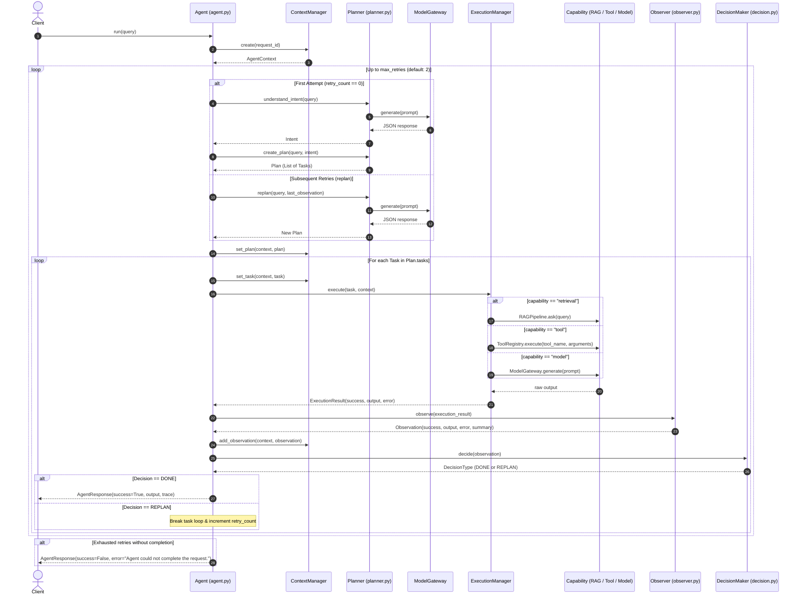

# Vexux-AI Architecture

## 1. Overview & System Philosophy

Vexux-AI is a modular, use-case-independent AI agent framework built around Small Language Models (SLMs), Retrieval-Augmented Generation (RAG), tool execution, and an iterative plan-execute-observe-decide control loop.

The core architecture is organized to keep the agent control flow completely decoupled from underlying model weights, specific prompt structures, vector stores, and external tool implementations.

---

## 2. The Three Conceptual Layers

```text
┌─────────────────────────────────────────────────────────────────┐
│                      INNER / AGENT LAYER                        │
│                                                                 │
│   ┌─────────────┐        ┌─────────────┐       ┌────────────┐   │
│   │   Planner   │ ───►   │  Execution  │ ───►  │  Observer  │   │
│   └─────────────┘        └─────────────┘       └────────────┘   │
│          ▲                                            │         │
│          │                 ┌───────────────┐          │         │
│          └──────────────── │ DecisionMaker │ ◄────────┘         │
│               (Replan)     └───────────────┘                    │
└─────────────────────────────────┬───────────────────────────────┘
                                  │
┌─────────────────────────────────▼───────────────────────────────┐
│                    MIDDLE / ARCHITECTURE LAYER                  │
│                                                                 │
│  - Model Gateway (core/model_gateway/gateway.py)                │
│  - Tool Registry (core/tools/registry.py)                       │
│  - Execution Manager (agent/execution_manager.py)               │
│  - Context Manager (core/context/context_manager.py)            │
│  - Contracts & Protocols (core/contracts/)                      │
│  - Dependency Injection Composition Root (core/composition.py)  │
└─────────────────────────────────┬───────────────────────────────┘
                                  │
┌─────────────────────────────────▼───────────────────────────────┐
│                     DATA / CAPABILITY LAYER                     │
│                                                                 │
│  - RAG Pipeline (DocumentLoader, Chunker, Embedder, FAISS, ...) │
│  - Model Providers (QwenProvider with PEFT LoRA adapter)        │
│  - Training & Fine-Tuning (SFTTrainer, LoRAManager, Datasets)   │
│  - Concrete Tools (CalculatorTool)                              │
└─────────────────────────────────────────────────────────────────┘
```

### Layer 1: Inner / Agent Layer
Contains the cognitive and control-loop primitives. This layer is responsible for planning, executing tasks against context, evaluating outcomes, and deciding whether to proceed, complete, or replan.
- **Agent** (`agent/agent.py`): Coordinates the lifecycle loop.
- **Planner** (`agent/planner.py`): Performs zero-shot SLM intent classification and task sequence generation.
- **Observer** (`agent/observer.py`): Normalizes raw execution outcomes into structured observations.
- **DecisionMaker** (`agent/decision.py`): Determines whether an observation satisfies the goal (`DONE`) or requires a new plan (`REPLAN`).

### Layer 2: Middle / Architecture Layer
Provides structural boundaries, data contracts, and dependency mediation.
- **Contracts** (`core/contracts/`): Strict dataclasses and `typing.Protocol` interfaces defining execution payloads, observations, capabilities, and agent responses.
- **ContextManager** (`core/context/context_manager.py`): Maintains state, tracks historical execution traces, and isolates session/request metadata.
- **ModelGateway** (`core/model_gateway/gateway.py`): Mediates LLM/SLM generation behind a standardized interface (`ModelProviderContract`).
- **ToolRegistry** (`core/tools/registry.py`): In-memory registry for discovering and executing tools implementing `ToolContract`.
- **ExecutionManager** (`agent/execution_manager.py`): Dispatches execution tasks to RAG, tools, or direct model calls.
- **Composition Root** (`core/composition.py`): Factory module (`create_agent()`) that wires concrete instances and handles dependency injection.

### Layer 3: Data / Capability Layer
Houses the domain-specific models, data processors, vector indices, training loops, and concrete tools.
- **RAG Subsystem** (`rag/`): File-based document loader, sliding-window chunker, `SentenceTransformer` embedder (`BAAI/bge-small-en-v1.5`), FAISS flat IP vector index, and contextual prompt builder.
- **Model Subsystem** (`models/`, `training/`): Hugging Face causal LM loader with 4-bit BitsAndBytes quantization, fine-tuned LoRA adapters (Qwen 2.5 0.5B Instruct), and standalone inference scripts.
- **Tools Subsystem** (`core/tools/`): Standalone capabilities such as the mathematical expression evaluator (`CalculatorTool`).
- **Training Subsystem** (`training/`, `lora/`, `data/`, `experiments/`): SFTTrainer fine-tuning factory, dataset loaders, JSONL formatters, and QLoRA training scripts.

---

## 3. Implementation Status: Implemented vs. Planned

| Component | Status | Location / Details |
| :--- | :--- | :--- |
| **Agent Loop (Single-Agent)** | **IMPLEMENTED** | `agent/agent.py` — supports linear task execution, retry loop (up to 2 retries), and replanning. |
| **Intent Classification & Planning** | **IMPLEMENTED** | `agent/planner.py` — classifies intents (`retrieval`, `tool`, `general`) and generates single-task `Plan`. |
| **Observer & Decision Maker** | **IMPLEMENTED** | `agent/observer.py`, `agent/decision.py` — maps `ExecutionResult` to `Observation` and decides `DONE`/`REPLAN`. |
| **Context Management** | **IMPLEMENTED** | `core/context/context_manager.py` — manages `AgentContext` and stores observation history. |
| **Model Gateway** | **IMPLEMENTED** | `core/model_gateway/gateway.py` — wraps `ModelProviderContract`. |
| **Tool Registry & Calculator Tool** | **IMPLEMENTED** | `core/tools/registry.py`, `core/tools/calculator.py` — registered tool execution. |
| **Local RAG Pipeline** | **IMPLEMENTED** | `rag/` — end-to-end RAG with FAISS vector store, BGE embeddings, and local inference. |
| **Qwen 2.5 SLM Provider (LoRA)** | **IMPLEMENTED** | `models/providers/qwen.py` — loads `Qwen/Qwen2.5-0.5B-Instruct` with PEFT adapter from `models/checkpoints`. |
| **QLoRA Fine-Tuning Pipeline** | **IMPLEMENTED** | `training/train.py`, `training/factory.py`, `experiments/qlora_train.py`. |
| **Contracts (`execution`, `observation`, `response`, `capabilities`)** | **IMPLEMENTED** | `core/contracts/` — dataclasses and protocols. |
| **Multi-Agent Execution** | **PLANNED** | Not implemented. The current system is strictly single-agent. |
| **Dynamic Multi-Step Graph / DAG Planning** | **PLANNED** | Not implemented. Current planner creates single-task plans (`task-1`). |
| **Dynamic Tool Schema Ingestion in Planner** | **PLANNED** | Not implemented. Tool prompts in `planner.py` are currently hardcoded for `calculator`. |
| **Persistent Memory (`MemoryContract`)** | **PLANNED** | Protocol defined in `core/contracts/capabilities.py`, but no concrete store exists. |
| **Evaluation Suite (`training/evaluate.py`)** | **PLANNED** | File exists as a placeholder (empty, 0 bytes). |
| **Streaming / Asynchronous Execution** | **PLANNED** | All current execution and generation calls are synchronous. |

---

## 4. Current Execution Flow

When a client invokes `agent.run(query)`:



---

## 5. Component Breakdown

### 5.1 Agent (`agent/agent.py`)
- **Class**: `Agent`
- **Responsibilities**:
  - Initializes request context via `ContextManager`.
  - Executes the outer retry loop (bounded by `max_retries = 2`).
  - Dispatches tasks sequentially from the active `Plan`.
  - Invokes `Observer` and `DecisionMaker` after every task.
  - Returns a unified `AgentResponse`.

### 5.2 Planner (`agent/planner.py`)
- **Class**: `Planner`
- **Responsibilities**:
  - `understand_intent(query, previous_observation)`: Prompts the SLM via `ModelGateway` to classify the user's input into `retrieval`, `tool`, or `general`.
  - `create_plan(query, intent, observation)`: Constructs a `Plan` containing a `Task` tagged with the matching capability metadata (`retrieval`, `tool`, or `model`).
  - `replan(query, observation)`: Generates an adjusted plan if a previous task execution failed.

### 5.3 Execution Manager (`agent/execution_manager.py`)
- **Class**: `ExecutionManager`
- **Responsibilities**:
  - Inspects `task.metadata["capability"]`.
  - Routes `retrieval` to `RAGPipeline.ask()`.
  - Routes `tool` to `ToolRegistry.execute()`.
  - Routes `model` to `ModelGateway.generate()`.
  - Wraps results and exceptions into an `ExecutionResult`.

### 5.4 Observer (`agent/observer.py`)
- **Class**: `Observer`
- **Responsibilities**:
  - Evaluates `ExecutionResult.success`.
  - Produces an `Observation` dataclass instance with human-readable summary annotations.

### 5.5 Decision Maker (`agent/decision.py`)
- **Class**: `DecisionMaker`
- **Responsibilities**:
  - Evaluates an `Observation` to return `DecisionType.DONE` (if `observation.success` is `True`) or `DecisionType.REPLAN` (if `False`).

### 5.6 Context Manager (`core/context/context_manager.py`)
- **Class**: `ContextManager`
- **Responsibilities**:
  - Instantiates and updates `AgentContext`.
  - Appends observations and tracks current task/plan pointers.

### 5.7 Model Gateway & Providers (`core/model_gateway/`, `models/providers/`)
- **`ModelGateway`**: Dispatches generation prompts to any implementation of `ModelProviderContract`.
- **`QwenProvider`**: Implements `ModelProviderContract` using Hugging Face's `AutoTokenizer` and `AutoModelForCausalLM` combined with a PEFT LoRA adapter loaded from `models/checkpoints`. Supports greedy decoding (`do_sample=False`) and sampling (`temperature`, `top_p`, `top_k`).

### 5.8 Tool Registry & Concrete Tools (`core/tools/`)
- **`ToolRegistry`**: In-memory registry with `register()`, `get()`, `list_tools()`, and `execute()` methods.
- **`CalculatorTool`**: Implements `ToolContract`, executing arithmetic expressions using a restricted `eval` namespace (`__builtins__: {}`).

### 5.9 RAG Pipeline (`rag/`)
- **`DocumentLoader`**: Reads `.txt` files from `data/documents/`.
- **`TextChunker`**: Fixed sliding-window text chunking (`chunk_size=80`, `overlap=20`).
- **`Embedder`**: Wraps `SentenceTransformer("BAAI/bge-small-en-v1.5")` with normalized output embeddings.
- **`VectorStore`**: Manages a FAISS `IndexFlatIP` index with document metadata storage.
- **`Retriever`**: Takes raw text queries, encodes them via `Embedder`, and searches `VectorStore`.
- **`PromptBuilder`**: Constructs context-augmented prompts for answer generation.
- **`RAGPipeline`**: Orchestrates loading, indexing, retrieval, and invokes `InferencePipeline` to answer questions.

### 5.10 Composition Root (`core/composition.py`)
- **Function**: `create_agent()`
- **Responsibilities**:
  - Wires all subsystems together via dependency injection.
  - Instantiates `QwenProvider` -> `ModelGateway` -> `RAGPipeline` -> `ToolRegistry` -> `ExecutionManager` -> `Planner` -> `Observer` -> `DecisionMaker` -> `ContextManager` -> `Agent`.
