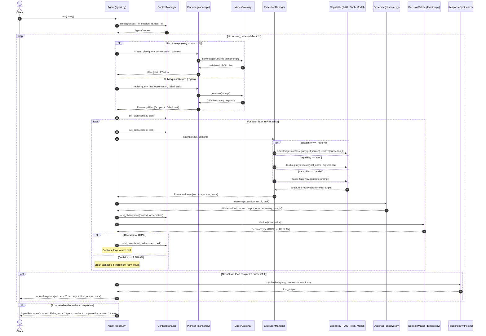

# Vexux-AI Architecture

## 1. Overview & System Philosophy

Vexux-AI is a modular, use-case-independent AI agent framework built around Small Language Models (SLMs), Retrieval-Augmented Generation (RAG), tool execution, and an iterative plan-execute-observe-decide control loop.

The core architecture is organized to keep the agent control flow completely decoupled from underlying model weights, specific prompt structures, vector stores, and external tool implementations.

---

## 2. The Three Conceptual Layers

```text
┌─────────────────────────────────────────────────────────────────┐
│                      INNER / AGENT LAYER                        │
│                                                                 │
│   ┌─────────────┐        ┌─────────────┐       ┌────────────┐   │
│   │   Planner   │ ───►   │  Execution  │ ───►  │  Observer  │   │
│   └─────────────┘        └─────────────┘       └────────────┘   │
│          ▲                                            │         │
│          │                 ┌───────────────┐          │         │
│          └──────────────── │ DecisionMaker │ ◄────────┘         │
│               (Replan)     └───────────────┘                    │
└─────────────────────────────────┬───────────────────────────────┘
                                  │
┌─────────────────────────────────▼───────────────────────────────┐
│                    MIDDLE / ARCHITECTURE LAYER                  │
│                                                                 │
│  - Model Gateway (core/model_gateway/gateway.py)                │
│  - Tool Registry (core/tools/registry.py)                       │
│  - Execution Manager (agent/execution_manager.py)               │
│  - Context Manager (core/context/context_manager.py)            │
│  - Contracts & Protocols (core/contracts/)                      │
│  - Dependency Injection Composition Root (core/composition.py)  │
└─────────────────────────────────┬───────────────────────────────┘
                                  │
┌─────────────────────────────────▼───────────────────────────────┐
│                     DATA / CAPABILITY LAYER                     │
│                                                                 │
│  - RAG Pipeline (DocumentLoader, Chunker, Embedder, FAISS, ...) │
│  - Model Providers (QwenProvider with PEFT LoRA adapter)        │
│  - Training & Fine-Tuning (SFTTrainer, LoRAManager, Datasets)   │
│  - Concrete Tools (CalculatorTool)                              │
└─────────────────────────────────────────────────────────────────┘
```

### Layer 1: Inner / Agent Layer
Contains the cognitive and control-loop primitives. This layer is responsible for planning, executing tasks against context, evaluating outcomes, recovering from failures, and synthesizing final answers.
- **Agent** (`agent/agent.py`): Coordinates the lifecycle loop across multiple tasks and manages replanning. As of Phase 13 the Agent also supports dependency-aware scheduling for Plan tasks (see "DAG / Dependency-aware execution" below).
  - **Planner** (`agent/planner.py`): Generates and validates structured plans. Planner now accepts an optional `depends_on` field on each Task and validates dependency correctness (duplicate IDs, unknown deps, self-deps, cycles). Planner continues to generate recovery plans that preserve task IDs for replanning.
- **Observer** (`agent/observer.py`): Normalizes raw execution outcomes into structured observations linked with `task_id`.
- **DecisionMaker** (`agent/decision.py`): Determines whether an observation satisfies the goal (`DONE`) or requires a new plan (`REPLAN`).
- **ResponseSynthesizer** (`agent/response_synthesizer.py`): Synthesizes multi-task observation outputs into a clear, unified final response.
- **Specialized Agents** (`core/specialized_agents/`): Optional role adapters around the existing Agent. The current reference implementation is `ResearchAgent`, a narrow adapter that reuses the agent's normal execution pipeline instead of creating a second planner or scheduler.
- **Controlled Delegation** (`core/orchestrator.py`): An explicit, deterministic way to fan out a request to multiple named agents; each delegated execution remains isolated to its own request-scoped context and results are aggregated without introducing automatic routing or a second scheduler.
- **Delegation Planning** (`core/specialized_agents/planner.py`): A small, controlled planning component that normalizes a structured `delegations` list into a `DelegationPlan`, validates IDs, dependencies, and dataflow references, and preserves DAG semantics without executing the underlying agents.

### Layer 2: Middle / Architecture Layer
Provides structural boundaries, data contracts, and dependency mediation.
- **Contracts** (`core/contracts/`): Strict dataclasses and `typing.Protocol` interfaces defining execution payloads, observations, capabilities, and agent responses.
- **ContextManager** (`core/context/context_manager.py`): Maintains state, tracks historical execution traces, records completed tasks, and isolates session/request metadata.
- **ModelGateway** (`core/model_gateway/gateway.py`): Mediates LLM/SLM generation behind a standardized interface (`ModelProviderContract`).
- **ToolRegistry** (`core/tools/registry.py`): In-memory registry for discovering and executing tools implementing `ToolContract`.
- **ExecutionManager** (`agent/execution_manager.py`): Dispatches execution tasks to RAG, tools, or direct model calls. It also supports explicit multi-graph retrieval tasks by executing multiple graph requests in parallel and aggregating the results with preserved graph provenance.
- **Orchestrator** (`core/orchestrator.py`): Selects the execution owner; it delegates to the direct Agent, workflows, or an explicitly selected specialized agent without redesigning the underlying execution stack.
- **Specialized Agent Registry** (`core/specialized_agents/`): Optional discovery/lookup registry for role-specific adapters. The current reference implementation is a thin `ResearchAgent` wrapper around the existing Agent.
- **Composition Root** (`core/composition.py`): Factory module (`create_agent()`) that wires concrete instances and handles dependency injection; optional orchestrator helpers can register specialized agents without changing the default Agent path.
- **Knowledge Graph Registry** (`core/knowledge/graph_registry.py`): Tracks independently registered in-memory knowledge graphs and allows graph routing through the normalized `KnowledgeRequest` layer without introducing a second graph contract.
- **FastAPI API** (`api/main.py`): Thin HTTP boundary delegating requests to the composition-root Agent.
- **Evaluation Suite** (`evaluation/`): Deterministic system-level evaluation runner with 44 scenarios.

### Authorization Boundary (Phase 24)

A small, resource-aware authorization boundary has been added to the architecture to control access to sensitive resources (knowledge graphs, registered knowledge sources, workflows, and specialized agents) while preserving the existing policy boundary and security/redaction mechanisms.

Key behaviors (implemented):

- Authorization contract types: `AuthorizationRequest` and `AuthorizationDecision` exist under `core/contracts/authorization.py` and express actor identity, resource type/name, action, and resulting decision metadata.
- Policy extension: `DefaultPolicy` exposes `authorize_resource(actor, resource_type, resource_name, action, context)` which returns a `PolicyDecision`. The default implementation is permissive to preserve backward compatibility.
- Enforcement points: the `ExecutionManager` and `Orchestrator` call `authorize_resource` prior to using protected resources:
 - ExecutionManager authorizes single-graph access, multi-graph access (before parallel submission), and registered knowledge-source access.
 - Orchestrator authorizes specialized-agent delegation before executing a delegated request.
- Multi-graph authorization occurs before any graph execution/submission; if any required graph is denied the current implementation rejects the entire multi-graph request and does not execute any of the requested graphs.
- Authorization failures are returned as controlled failures (clear error strings and safe metadata) and do not cause uncaught exceptions, nor do they silently fall back to alternative resources.
- Observability: authorization decisions are surfaced via execution/response metadata (policy name and safe reason) without exposing internal policy implementation details or raw protected data.
- Security separation: authorization is distinct from the existing security/redaction mechanisms — the authorization layer decides access; redaction remains responsible for removing or masking sensitive payloads in traces.

This keeps the authorization layer small, deterministic, and domain-agnostic while integrating with the established policy boundary and preserving existing behavior when no custom policy is configured.

### Production API boundary (Phase 30)

The FastAPI layer exposes the existing Agent at `POST /api/v1/agent/run` and the
thin Orchestrator at `POST /api/v1/orchestrator/run`. Both use the same safe
request/response shape and preserve `AgentResponse` success and error semantics.
The API accepts caller-supplied `session_id` and `user_id`; it does not implement
authentication.

`GET /health` is a process liveness check. `GET /ready` validates the centralized
configuration without making model or network calls. `GET /api/v1/orchestrator/{id}/trace`
returns only redacted audit events matching a request or orchestration ID.

### End-to-end integration scenarios (Phase 29)

The integration coverage exercises the existing secured multi-graph flow:
`Orchestrator -> authorization -> multi-graph retrieval -> aggregation -> EvidenceSet -> response -> audit`.
Required multi-graph requests are all-or-nothing: a denied graph prevents submission of every graph request.

The autonomous delegation scenario uses `LLMDelegationPlanner` with an injected deterministic
gateway, validates the structured plan through `DelegationPlanner`, and records delegated-agent
audit events. Invalid model JSON is a controlled planning failure with no fallback execution.

Configuration portability is verified through `MODEL_PROVIDER=fake` and the existing centralized
configuration boundary. Persistent memory remains optional and is only used when explicitly
configured; it is not written implicitly for ordinary requests. Integration tests use synthetic
data and do not add a scheduler, graph backend, security framework, or distributed infrastructure.

### Layer 3: Data / Capability Layer
Houses the domain-specific models, data processors, vector indices, training loops, and concrete tools.
- **RAG Subsystem** (`rag/`): File-based document loader, sliding-window chunker, `SentenceTransformer` embedder (`BAAI/bge-small-en-v1.5`), FAISS flat IP vector index, and contextual prompt builder.
- **Model Subsystem** (`models/`, `training/`): Hugging Face causal LM loader with 4-bit BitsAndBytes quantization, fine-tuned LoRA adapters (Qwen 2.5 0.5B Instruct), and standalone inference scripts.
- **Tools Subsystem** (`core/tools/`): Standalone capabilities such as the mathematical expression evaluator (`CalculatorTool`).
- **Training Subsystem** (`training/`, `lora/`, `data/`, `experiments/`): SFTTrainer fine-tuning factory, dataset loaders, JSONL formatters, and QLoRA training scripts.

---

## 3. Implementation Status: Implemented vs. Planned

| Component | Status | Location / Details |
| :--- | :--- | :--- |
| **Agent Loop (Multi-Task & Recovery)** | **IMPLEMENTED** | `agent/agent.py` — supports sequential multi-task execution, scoped failure recovery, retry loop (up to 2 retries), and trace preservation. |
| **Structured Planning & Recovery** | **IMPLEMENTED** | `agent/planner.py` — generates validated sequential `Plan`/`Task` JSON and targeted recovery plans. |
| **Observer & Decision Maker** | **IMPLEMENTED** | `agent/observer.py`, `agent/decision.py` — maps `ExecutionResult` to `Observation` (with `task_id`) and decides `DONE`/`REPLAN`. |
| **Response Synthesizer** | **IMPLEMENTED** | `agent/response_synthesizer.py` — synthesizes multi-task observation outputs into unified final answers. |
| **Context Management & Sessions** | **IMPLEMENTED** | `core/context/context_manager.py` — manages request traces and bounded in-memory conversation history by `session_id`. |
| **Model Gateway** | **IMPLEMENTED** | `core/model_gateway/gateway.py` — wraps `ModelProviderContract`. |
| **Tool Registry & Calculator Tool** | **IMPLEMENTED** | `core/tools/registry.py`, `core/tools/calculator.py` — registered tool execution. |
| **Local RAG Pipeline** | **IMPLEMENTED** | `rag/` — scored retrieval through `RAGPipeline.retrieve()` with configurable top-k and relevance handling. |
| **Knowledge Source Abstraction** | **IMPLEMENTED** | `KnowledgeSourceRegistry` dispatches the current RAG source through `RAGKnowledgeSource`; retrieval tasks may select registered sources and grounded responses attribute the selected source. |
| **Qwen 2.5 SLM Provider (LoRA)** | **IMPLEMENTED** | `models/providers/qwen.py` — loads `Qwen/Qwen2.5-0.5B-Instruct` with PEFT adapter from `models/checkpoints`. |
| **QLoRA Fine-Tuning Pipeline** | **IMPLEMENTED** | `training/train.py`, `training/factory.py`, `experiments/qlora_train.py`. |
| **Contracts (`execution`, `observation`, `response`, `capabilities`)** | **IMPLEMENTED** | `core/contracts/` — dataclasses and protocols. |
| **Multi-Agent Execution** | **PLANNED** | Not implemented. The current system is strictly single-agent. |
| **Dynamic Multi-Step Graph / DAG Planning** | **IMPLEMENTED (Phase 13, 14)** | `agent/planner.py` & `agent/agent.py` — Planner accepts optional `depends_on` on Tasks; Agent executes dependency-aware scheduling. Phase 13 introduced deterministic sequential DAG execution and failure propagation. Phase 14 adds bounded local concurrency: independent ready tasks may execute in parallel (configurable via `AGENT_MAX_PARALLEL_TASKS`, default 1). Limitations: execution remains local-only (no distributed scheduling), no dataflow/output-substitution, and cycles are rejected. |
| **Dynamic Tool Discovery** | **IMPLEMENTED** | `ToolRegistry` metadata, including lightweight input schemas, is injected into Planner prompts. |
| **Persistent Memory (`MemoryContract`)** | **PLANNED** | Protocol defined in `core/contracts/capabilities.py`, but no concrete store exists. |
| **Evaluation Suite (`evaluation/`)** | **IMPLEMENTED** | 44 deterministic system-level scenarios with category and failure reporting. |
| **Streaming / Asynchronous Execution** | **PLANNED** | All current execution and generation calls are synchronous. |

---

## 4. Current Execution Flow

When a client invokes `agent.run(query)`:



---

## 5. Component Breakdown

### 5.1 Agent (`agent/agent.py`)
- **Class**: `Agent`
- **Responsibilities**:
  - Initializes request context via `ContextManager`.
  - Executes the outer retry loop (bounded by `max_retries = 2`).
  - Dispatches tasks sequentially from the active `Plan`.
  - Invokes `Observer` and `DecisionMaker` after every task.
  - On task success, records the task into `context.completed_tasks`.
  - On task failure, triggers `Planner.replan()` with the failed task and preserves remaining unexecuted tasks without repeating completed tasks.
  - Delegates final response generation to `ResponseSynthesizer` upon successful completion.

### 5.2 Planner (`agent/planner.py`)
- **Class**: `Planner`
- **Responsibilities**:
  - `create_plan(query, conversation_context)`: Prompts the SLM for a structured JSON plan and validates every task before creating `Plan` and `Task` objects.
  - `replan(query, observation, failed_task, conversation_context)`: Generates and validates a single recovery task scoped specifically to `failed_task`.
  - Tool metadata and input schemas are obtained dynamically from `ToolRegistry`; registered knowledge-source metadata is included without embedding individual source implementations.

### 5.3 Execution Manager (`agent/execution_manager.py`)
- **Class**: `ExecutionManager`
- **Responsibilities**:
  - Inspects `task.metadata["capability"]`.
  - Routes `retrieval` through `KnowledgeSourceRegistry` when configured and returns the existing structured query/results/context output.
  - Routes `tool` to `ToolRegistry.execute()`.
  - Routes `model` to `ModelGateway.generate()`.
  - Wraps results and exceptions into an `ExecutionResult`.

### 5.4 Observer (`agent/observer.py`)
- **Class**: `Observer`
- **Responsibilities**:
  - Evaluates `ExecutionResult.success`.
  - Produces an `Observation` dataclass instance with `task_id` and descriptive summary annotations.

### 5.5 Decision Maker (`agent/decision.py`)
- **Class**: `DecisionMaker`
- **Responsibilities**:
  - Evaluates an `Observation` to return `DecisionType.DONE` (if `observation.success` is `True`) or `DecisionType.REPLAN` (if `False`).

### 5.6 Response Synthesizer (`agent/response_synthesizer.py`)
- **Class**: `ResponseSynthesizer`
- **Responsibilities**:
  - Collects outputs from all successful observations in the request trace.
  - Invokes `ModelGateway.generate()` to compose a cohesive, clean user-facing response combining multi-task outputs without revealing internal agent execution details.

### 5.7 Context Manager (`core/context/context_manager.py`)
- **Class**: `ContextManager`
- **Responsibilities**:
  - Instantiates and updates `AgentContext`.
  - Manages `observations`, `current_plan`, `current_task`, and `completed_tasks`.
  - Maintains bounded in-memory conversation history isolated by `session_id`.

### 5.8 Model Gateway & Providers (`core/model_gateway/`, `models/providers/`)
- **`ModelGateway`**: Dispatches generation prompts to any implementation of `ModelProviderContract`.
- **`QwenProvider`**: Implements `ModelProviderContract` using Hugging Face's `AutoTokenizer` and `AutoModelForCausalLM` combined with a PEFT LoRA adapter loaded from `models/checkpoints`. Supports greedy decoding (`do_sample=False`) and sampling (`temperature`, `top_p`, `top_k`).

### 5.12 API and Observability
- **FastAPI** (`api/main.py`): Exposes `POST /api/v1/agent/run`, validates requests, delegates to `Agent.run()`, and serializes `AgentResponse`.
- **Structured observability** (`agent/agent.py`): Logs request/session/task identifiers, capability, execution outcome, and duration for each task.
- The API does not contain planning, execution, observation, or retry orchestration logic.

### 5.9 Tool Registry & Concrete Tools (`core/tools/`)
- **`ToolRegistry`**: In-memory registry with `register()`, `get()`, `list_tools()`, `describe_tools()`, and `execute()` methods.
- **`CalculatorTool`**: Implements `ToolContract`, executing arithmetic expressions using a restricted `eval` namespace (`__builtins__: {}`).

### 5.10 RAG Pipeline (`rag/`)
- **`DocumentLoader`**: Reads `.txt` files from `data/documents/`.
- **`TextChunker`**: Fixed sliding-window text chunking (`chunk_size=80`, `overlap=20`).
- **`Embedder`**: Wraps `SentenceTransformer("BAAI/bge-small-en-v1.5")` with normalized output embeddings.
- **`VectorStore`**: Manages a FAISS `IndexFlatIP` index with document metadata storage.
- **`Retriever`**: Takes raw text queries, encodes them via `Embedder`, and searches `VectorStore`.
- **`PromptBuilder`**: Constructs context-augmented prompts for answer generation.
- **`RAGPipeline`**: Orchestrates loading, indexing, retrieval, and invokes `InferencePipeline` to answer questions.
- **`RAGKnowledgeSource`**: Adapts `RAGPipeline.retrieve()` to the generic `KnowledgeSourceContract` without changing RAG behavior.

### 5.11 Knowledge Sources (`core/knowledge/`)
- **`KnowledgeSourceRegistry`**: Registers and describes domain-agnostic sources, with the first registered source serving existing retrieval tasks by default.
- **Current source**: `RAGKnowledgeSource` only. SQL, knowledge graph, API documentation, and external knowledge sources are not implemented, and no planner-based source routing exists.
- **Knowledge Decision (Phase 11)**: A small, domain-agnostic decision/normalization layer (`core/knowledge/decision.py`) determines which knowledge capability should be used for a request (RAG, registered knowledge source, or knowledge graph). This component only expresses and validates the decision — it does not execute retrievals and does not perform multi-source fusion. It is intentionally conservative: explicit source requests are validated and will error if the source is unavailable; no silent fallback occurs when a user names a specific source.

### 5.12 Composition Root (`core/composition.py`)
- **Function**: `create_agent()`
- **Responsibilities**:
  - Wires all subsystems together via dependency injection.
  - Instantiates `QwenProvider` -> `ModelGateway` -> `RAGPipeline` -> `RAGKnowledgeSource` -> `KnowledgeSourceRegistry` -> `ToolRegistry` -> `ExecutionManager` -> `Planner` -> `Observer` -> `DecisionMaker` -> `ContextManager` -> `ResponseSynthesizer` -> `Agent`.

### Persistent Memory (Phase 9)
- **Optional**: A minimal persistent-memory layer is available and is disabled by default. Enable by setting the environment variable `PERSISTENT_MEMORY_DB` to a filesystem path.
- **Composition behavior**: When enabled the Composition Root will create a `MemoryRegistry` and register a local `SQLiteMemory` backend pointed at the configured file; the `Agent` receives the `memory_registry` as an optional dependency.
- **Design constraints**:
  - Scoped: memories are stored and queried by an explicit scope identifier (for example a user id or session id).
  - Explicit: persistent memory is only read or written by explicit memory operations; normal agent runs do not automatically persist or retrieve persistent memory.
  - Secure: the memory backend reuses the repository's redaction utilities and rejects obvious secret-like inputs.
  - Minimal: Phase 9 provides store/retrieve/clear only — no embeddings, vector search, or automatic extraction.
